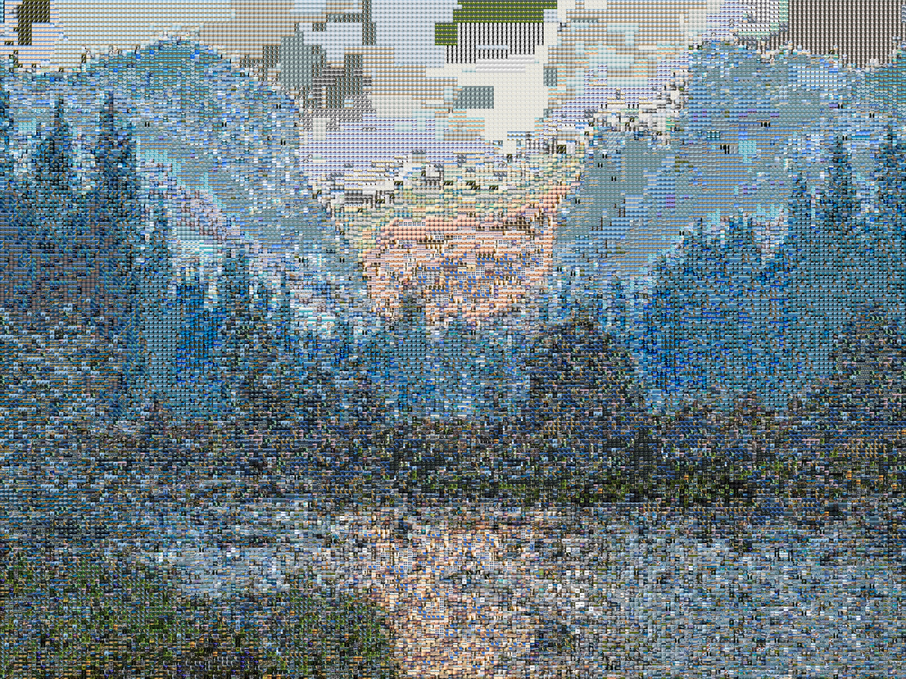

This is a Python-based photomosaic generation program.

An example of how to use the software is included in the `example_driver` function in the script.

Some notes for use:
* The dataset makes or breaks the end result. The more photos (thousands!) the better. The less variation in each photo (e.g. photo is mostly blue, mostly green, etc.), the better!
* The more tiles the better. Recommend at least 100 tiles in either dimension.

Future improvements if I come back to this side project:
* Embedding the game in a PyQt5 GUI
* Adding color filters to each tile to shift the color towards the ideal color of that tile based on the original image
* Adding an opacity option to overlay the original image with the photomosaic

Example usage- original photo:

Output (1800x2400px, 200x150 tiles):

*Disclaimer: None of the photos in this example are mine. The source photo is from [redditor u/KarenToribio](https://www.reddit.com/r/wallpaper/comments/o6tiw0/yosemite_valley_1920x1080/), and the dataset used to generate this mosaic is from [Kaggle user arnaud58](https://www.kaggle.com/arnaud58/landscape-pictures)*